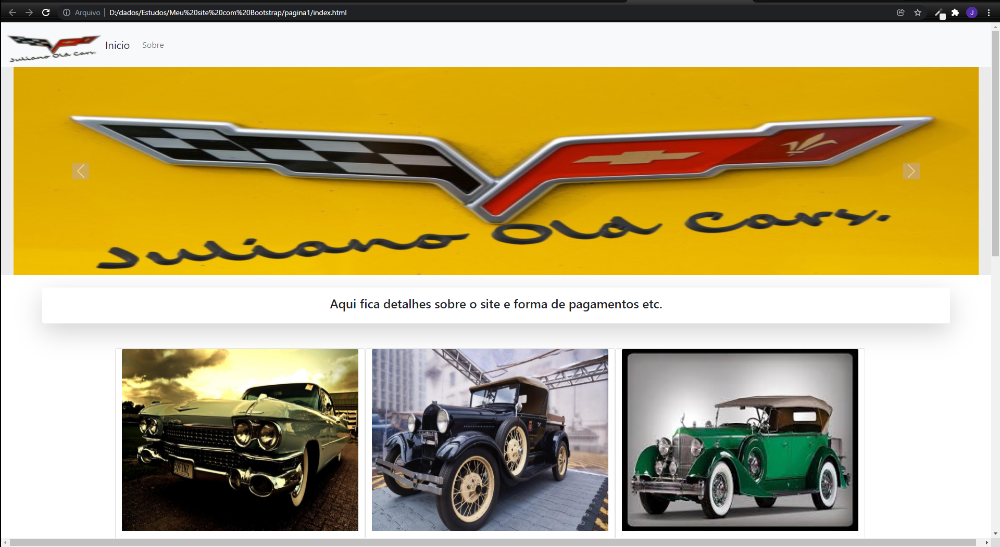

<h1 align="center"> Criando site com Bootstrap. </h1>

 Criei este projeto para mostrar um site simples e funcional.

<!---->
   * [Sobre](#Sobre)
   *[Tecnologias](#Tecnologias)
   * [Pré-requisitos](#Pre requisitos)
   * [Autor](#Autor)
  
<!---->
<h1 align="center">

</h1>

# Sobre

Este e um site bem simples mas funcional para demostrar o conceito basico da construção de um site com Bootstrap.

# Tecnologias

Este projeto foi desenvolvido com:

Bootstrap

HTML

CSS

JavaScript

# Pre requisitos
Ter instalado [VSCode](https://code.visualstudio.com/) na sua máquina.

Logica de programação

Bootstrap

HTML

CSS

Java Scrit

# Autor

[Juliano Rodrigo](https://www.linkedin.com/in/juliano-rodrigo-88a1a1168/)
